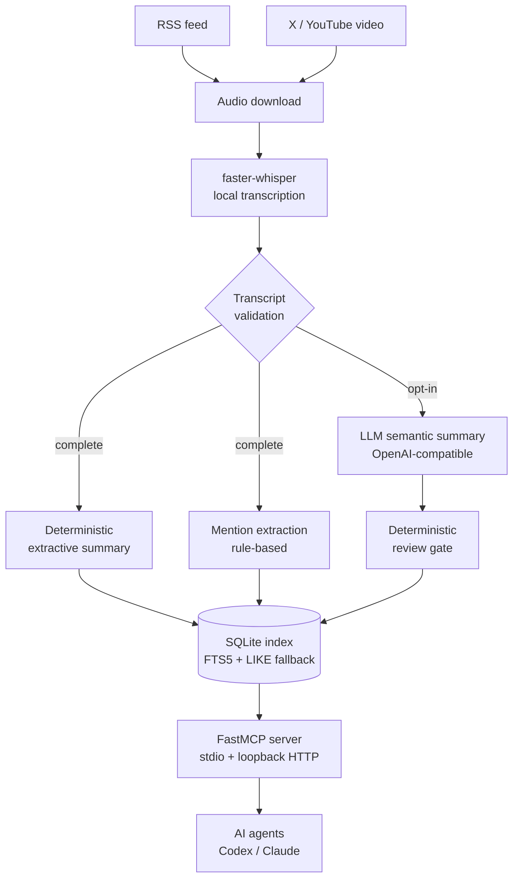

# Podcast Ingestion Core

Turns podcast audio into verifiable, searchable knowledge. It takes an RSS
feed (or an X / YouTube video), transcribes it locally with faster-whisper, and
produces timestamped transcripts, summaries, entity mentions, and research
artifacts on disk — exposed to AI agents through an MCP server and Skills.

[](https://github.com/norton77930/corpus-ingest-core/actions/workflows/tests.yml)

[繁體中文說明](README.zh-TW.md)

**In:** a podcast RSS feed, or a video URL.
**Out:** transcripts, subtitles, summaries, mention indexes, and research
report bundles under `data/`, plus a SQLite index for cross-episode search.

Nothing this project produces is investment advice.

## Why it exists

Podcast audio is hard to cite. A claim you half-remember from an episode three
months ago is effectively unrecoverable. This project makes that content
addressable: every extracted claim keeps a timestamp back to the audio, so an
answer can be traced to the second it was said.

Two properties follow from that goal and shape the whole design:

- **Local-first.** Transcription runs on your machine. Audio and transcripts do
  not leave it unless you explicitly opt into an LLM step.
- **Evidence over inference.** The deterministic path is the default. LLM
  interpretation is a separate, opt-in layer that never overwrites it.

## Quickstart

Requires Python 3.11+. Examples use PowerShell; any shell works.

```powershell
git clone https://github.com/<your-account>/corpus-ingest-core.git
cd corpus-ingest-core
python -m venv .venv
.\.venv\Scripts\Activate.ps1
python -m pip install -e .[dev]

python scripts/list_episodes.py --podcast gooaye --limit 5
python scripts/download_episode.py --podcast gooaye --episode latest
python scripts/transcribe_episode.py --podcast gooaye --episode latest --model tiny --device cpu --compute-type int8
python scripts/summarize_episode.py --podcast gooaye --episode latest --mode extractive
```

Start with `--model tiny` to verify the pipeline end to end; a full episode on
CPU is slow. Switch to `--model small --device cuda --compute-type float16`
once you know it works. Then build the index and search across episodes:

```powershell
python scripts/rebuild_cache.py --podcast gooaye --force
python scripts/search_transcripts.py --podcast gooaye --query TSMC --limit 10
```

Add your own podcast by appending a profile to `config/podcasts.yaml`. The core
never hard-codes a specific show.

## Architecture



Every stage reads artifacts the previous stage wrote to `data/` and writes its
own. There is no hidden state: delete the SQLite cache and it rebuilds from the
files. The transcripts, summaries, and mentions on disk are the source of
truth.

### Two summary paths, kept apart on purpose

This is the central design decision, and it is not an implementation detail.

| | Deterministic path | LLM path |
| --- | --- | --- |
| Entry point | `summarize_episode` | `semantic_summarize_episode` |
| Method | rule-based extraction from transcript segments | OpenAI-compatible API over transcript chunks |
| Network | none | sends transcript text off the machine |
| Credentials | none | API key, plus an exact cost acknowledgement |
| Reproducibility | same input, same output, forever | not reproducible |
| Output file | `.md` | `.semantic.md` |

They are never substituted for each other. Anything the deterministic path
produces can be re-derived offline from the transcript alone; anything the LLM
path produces cannot, so it is labelled as an LLM intermediate artifact rather
than as podcast evidence, and it passes a deterministic review gate before
downstream steps may consume it.

The reason is auditability. When a research artifact cites an episode, you need
to know whether that claim came from the audio or from a model's reading of the
audio. Merging the two paths would destroy that distinction permanently, and
no amount of prompt engineering gets it back.

Mention extraction follows the same rule: it scans for companies, tickers,
industries, macro topics, crypto, and places using deterministic rules, and
each mention keeps timestamp evidence. It is not semantic understanding and
does not claim to be.

### Agent interface

The MCP server exposes the same core functions to AI agents over a single
`FastMCP` instance: stdio for local clients, and a reviewed sidecar serving
Streamable HTTP bound to `127.0.0.1:8767/mcp` only.

Every tool that writes, downloads, or spends money defaults to `confirm=false`
and returns an action plan instead of acting. Tools that would send transcript
text to an external provider require an exact acknowledgement string on top of
that. No tool rebuilds the search index behind your back.

```powershell
python scripts/validate_mcp_setup.py --podcast gooaye --query TSMC
python scripts/run_mcp_server.py
```

## What works today

Implemented: RSS episode listing and lookup, audio download, local
faster-whisper transcription, transcript validation, deterministic extractive
summaries, opt-in LLM semantic summaries with a review gate, deterministic
mention extraction, SQLite metadata cache and search, X and YouTube video
ingest, deterministic research artifacts (episode intelligence, industry chain
mapping, external data boundary, stock lens), verified research report bundles
with content-digest versioning, and the MCP server over both transports.

Not implemented: web UI, scheduling, embeddings, and vector search. External
market data is deliberately bounded to local fixtures — there is no live market
API, and adding one would be an explicit, reviewed decision rather than a
feature.

## Documentation

- [`docs/api.md`](docs/api.md) — complete function reference, output paths, CLI
  reference, and the MCP tool registry
- [`docs/architecture.md`](docs/architecture.md) — architecture in depth
- [`docs/install-and-porting.md`](docs/install-and-porting.md) — clean install
  and moving the project to another machine
- [`docs/mcp-usage.md`](docs/mcp-usage.md),
  [`docs/claude-mcp-setup.md`](docs/claude-mcp-setup.md),
  [`docs/codex-mcp-setup.md`](docs/codex-mcp-setup.md),
  [`docs/mcp-troubleshooting.md`](docs/mcp-troubleshooting.md) — connecting an
  agent
- [`docs/agent-handoff.md`](docs/agent-handoff.md) — project status, spec
  history, blockers, and the entry point for anyone (human or agent) picking up
  development, including the
  [2026-08-19 session handoff](docs/agent-handoff.md#handoff--corpus-ingest-core-2026-08-19) relocated from the repo root
- [`CONTRIBUTING.md`](CONTRIBUTING.md) — setup, how to verify a change, the
  product boundaries a change must not cross, and the hash-pinned files that
  must not be edited
- [`SECURITY.md`](SECURITY.md) — reporting a vulnerability privately
- [`docs/ai-development-framework.md`](docs/ai-development-framework.md),
  [`docs/verification-matrix.md`](docs/verification-matrix.md),
  [`docs/architecture-decision-records/README.md`](docs/architecture-decision-records/README.md),
  [`AGENTS.md`](AGENTS.md) — change classification, guard-test matrix, and
  decision records

Evaluation suites, for checking that an agent uses the tools within their
declared boundaries:
[`docs/mcp-tool-use-eval.md`](docs/mcp-tool-use-eval.md),
[`docs/mcp-eval-prompts.md`](docs/mcp-eval-prompts.md),
[`docs/mcp-eval-report-template.md`](docs/mcp-eval-report-template.md),
[`docs/research-safety-eval.md`](docs/research-safety-eval.md),
[`docs/research-eval-prompts.md`](docs/research-eval-prompts.md),
[`docs/research-llm-smoke.md`](docs/research-llm-smoke.md).

## Development

```powershell
python -m pytest
python -m compileall src scripts
```

There is no `--ignore` list: the whole suite runs and is expected to be green.

Scripts stay thin: they parse arguments and call `corpus_ingest_core`. New
behaviour is developed test-first. `.env` is local-only and must never be
committed.

## Disclaimer

This project organizes podcast content for research and does **not** provide
investment advice. It produces no buy, sell, or hold recommendations, no target
prices, no guaranteed returns, and nothing personalized to your situation.
Summaries and extracted mentions can be incomplete or wrong, and LLM-generated
content can be confidently mistaken. Verify anything that matters against the
original audio and a primary source.

## License

MIT — see [LICENSE](LICENSE). No third-party source is vendored on `main`; an
archived tag still carries one MIT-licensed snapshot, noted in
[THIRD-PARTY-NOTICES.md](THIRD-PARTY-NOTICES.md).
