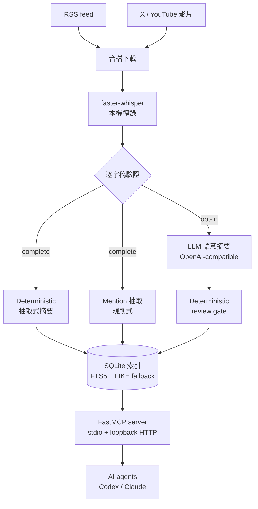

# Podcast Ingestion Core

把 podcast 音訊變成可驗證、可搜尋的知識。輸入一個 RSS feed(或 X / YouTube 影片),
在本機用 faster-whisper 轉錄,產出帶時間戳的逐字稿、摘要、實體 mention 與研究
artifacts,並透過 MCP server 與 Skills 提供給 AI agent 使用。

[](https://github.com/norton77930/corpus-ingest-core/actions/workflows/tests.yml)

[English](README.md)

**輸入:**podcast RSS feed,或影片 URL。
**輸出:**`data/` 底下的逐字稿、字幕、摘要、mention 索引與研究報告 bundle,
以及一個支援跨集搜尋的 SQLite 索引。

本專案的任何產出都不構成投資建議。

## 這個專案要解決什麼

Podcast 內容很難引用。三個月前某一集裡你只記得一半的說法,實際上等於找不回來。
這個專案讓那些內容變成可定址的:每一筆抽出的資訊都保留回到音檔的時間戳,
所以任何答案都能追回到它被說出來的那一秒。

從這個目標推導出兩個貫穿整體設計的性質:

- **本機優先(local-first)。** 轉錄在你自己的機器上跑。除非你明確選擇啟用
  LLM 步驟,音檔與逐字稿不會離開這台機器。
- **證據優先於推論。** deterministic 路徑是預設。LLM 詮釋是獨立的、需要明確
  opt-in 的一層,而且永遠不會覆蓋 deterministic 的結果。

## 快速開始

需要 Python 3.11 以上。範例使用 PowerShell,其他 shell 同樣適用。

```powershell
git clone https://github.com/<your-account>/podcast-ingest-core.git
cd podcast-ingest-core
python -m venv .venv
.\.venv\Scripts\Activate.ps1
python -m pip install -e .[dev]

python scripts/list_episodes.py --podcast gooaye --limit 5
python scripts/download_episode.py --podcast gooaye --episode latest
python scripts/transcribe_episode.py --podcast gooaye --episode latest --model tiny --device cpu --compute-type int8
python scripts/summarize_episode.py --podcast gooaye --episode latest --mode extractive
```

先用 `--model tiny` 把整條流程跑通;完整一集在 CPU 上很慢。確認流程沒問題後
再換成 `--model small --device cuda --compute-type float16`。接著建索引並跨集搜尋:

```powershell
python scripts/rebuild_cache.py --podcast gooaye --force
python scripts/search_transcripts.py --podcast gooaye --query 台積電 --limit 10
```

要加入自己的 podcast,在 `config/podcasts.yaml` 追加一個 profile 即可。核心程式
不會寫死任何特定節目。

## 架構



每個階段都讀取上一階段寫進 `data/` 的 artifacts,再寫出自己的。沒有隱藏狀態:
刪掉 SQLite cache,它可以從檔案完全重建。磁碟上的逐字稿、摘要與 mentions
才是 source of truth。

### 兩條摘要路徑是刻意分開的

這是核心設計決策,不是實作細節。

| | Deterministic 路徑 | LLM 路徑 |
| --- | --- | --- |
| 進入點 | `summarize_episode` | `semantic_summarize_episode` |
| 方法 | 從 transcript segments 規則式抽取 | 對 transcript chunks 呼叫 OpenAI-compatible API |
| 網路 | 不需要 | 會把逐字稿文字送出這台機器 |
| 憑證 | 不需要 | 需要 API key,以及一段精確的成本確認字串 |
| 可重現性 | 同樣輸入永遠得到同樣輸出 | 不可重現 |
| 輸出檔 | `.md` | `.semantic.md` |

兩者永遠不會互相取代。deterministic 路徑的產出可以離線只憑逐字稿重新推導出來;
LLM 路徑的產出不行,因此它被標記為 LLM 中間產物而非 podcast 證據,而且必須先
通過 deterministic review gate,下游步驟才能使用。

理由是可稽核性。當一份研究 artifact 引用某一集時,你必須知道那個說法來自音檔本身,
還是來自模型對音檔的解讀。把兩條路徑合併會永久摧毀這個區分,而且事後再怎麼調
prompt 都救不回來。

Mention 抽取遵循同樣的原則:它用 deterministic rules 掃描公司、ticker、產業、
總經主題、crypto 與地點,每筆 mention 都保留 timestamp evidence。它不是語意理解,
也不宣稱自己是。

### Agent 介面

MCP server 用單一 `FastMCP` instance 把同一組 core functions 提供給 AI agent:
本機 client 走 stdio,經審查的 sidecar 提供只綁定 `127.0.0.1:8767/mcp` 的
Streamable HTTP。

每個會寫檔、下載或花錢的 tool 都預設 `confirm=false`,先回傳 action plan 而不執行。
會把逐字稿送到外部 provider 的 tool,除此之外還要求一段精確的 acknowledgement。
沒有任何 tool 會在你不知情的狀況下重建搜尋索引。

```powershell
python scripts/validate_mcp_setup.py --podcast gooaye --query 台積電
python scripts/run_mcp_server.py
```

## 目前實作到哪

已實作:RSS episode listing 與 lookup、音檔下載、本機 faster-whisper 轉錄、
transcript validation、deterministic 抽取式摘要、可 opt-in 且帶 review gate 的
LLM 語意摘要、deterministic mention extraction、SQLite metadata cache 與搜尋、
X 與 YouTube 影片擷取、deterministic 研究 artifacts(episode intelligence、
產業鏈 mapping、external data boundary、stock lens)、以 content digest 版本化的
verified research report bundle,以及兩種 transport 的 MCP server。

未實作:Web UI、排程、embedding 與 vector search。外部市場資料刻意限制在本機
fixture — 沒有 live market API,要加入的話必須是一次明確且經過審查的決定,
而不是順手加的功能。

## 文件

- [`docs/api.md`](docs/api.md) — 完整函式參考、輸出路徑、CLI 參考與 MCP tool registry
- [`docs/architecture.md`](docs/architecture.md) — 架構細節
- [`docs/install-and-porting.md`](docs/install-and-porting.md) — 乾淨安裝與移機
- [`docs/mcp-usage.md`](docs/mcp-usage.md)、
  [`docs/claude-mcp-setup.md`](docs/claude-mcp-setup.md)、
  [`docs/codex-mcp-setup.md`](docs/codex-mcp-setup.md)、
  [`docs/mcp-troubleshooting.md`](docs/mcp-troubleshooting.md) — 接上 agent
- [`docs/agent-handoff.md`](docs/agent-handoff.md) — 專案狀態、spec 歷史、blockers,
  以及接手開發(不論是人或 agent)的入口,包含從根目錄移入的
  [2026-08-19 session handoff](docs/agent-handoff.md#handoff--podcast-ingest-core-2026-08-19)
- [`CONTRIBUTING.md`](CONTRIBUTING.md) — 環境設定、如何驗證一個變更、
  不可跨越的產品邊界,以及被雜湊釘選、不可編輯的檔案
- [`SECURITY.md`](SECURITY.md) — 私下通報漏洞
- [`docs/ai-development-framework.md`](docs/ai-development-framework.md)、
  [`docs/verification-matrix.md`](docs/verification-matrix.md)、
  [`docs/architecture-decision-records/README.md`](docs/architecture-decision-records/README.md)、
  [`AGENTS.md`](AGENTS.md) — 變更分類、guard test 對照表與決策記錄

評測套件,用來確認 agent 在宣告的邊界內使用工具:
[`docs/mcp-tool-use-eval.md`](docs/mcp-tool-use-eval.md)、
[`docs/mcp-eval-prompts.md`](docs/mcp-eval-prompts.md)、
[`docs/mcp-eval-report-template.md`](docs/mcp-eval-report-template.md)、
[`docs/research-safety-eval.md`](docs/research-safety-eval.md)、
[`docs/research-eval-prompts.md`](docs/research-eval-prompts.md)、
[`docs/research-llm-smoke.md`](docs/research-llm-smoke.md)。

## 開發

```powershell
python -m pytest
python -m compileall src scripts
```

沒有 `--ignore` 清單:整套測試都會執行,而且應該全綠。

Scripts 維持 thin:只負責解析參數並呼叫 `podcast_ingest_core`。新行為採 test-first
開發。`.env` 只存在本機,絕不可 commit。

## 免責聲明

本專案整理 podcast 內容供研究使用,**不構成投資建議**。它不提供買進、賣出或持有
建議,不提供目標價,不保證報酬,也不提供任何針對個人狀況的建議。摘要與抽出的
mention 可能不完整或有誤,LLM 產生的內容也可能在錯誤的同時看起來很有把握。
任何重要的事情,請回到原始音檔與第一手資料查證。

## 授權

MIT — 見 [LICENSE](LICENSE)。`main` 上沒有 vendored 任何第三方原始碼;有一份
MIT 授權的快照仍保留在封存 tag 中,說明見
[THIRD-PARTY-NOTICES.md](THIRD-PARTY-NOTICES.md)。
